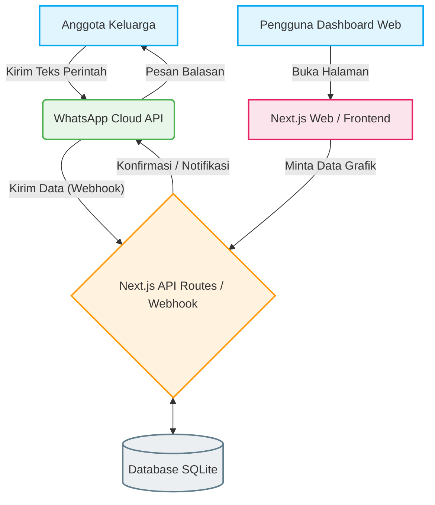
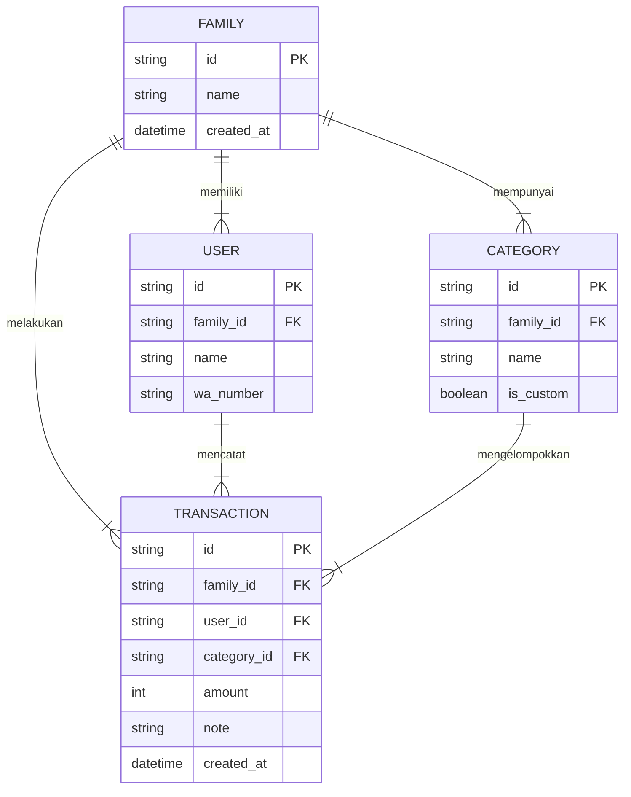

# PRD — Project Requirements Document

## 1. Overview
Aplikasi ini adalah platform pencatat pengeluaran keluarga yang dirancang agar sangat praktis dan mudah digunakan. Banyak keluarga kesulitan melacak pengeluaran harian karena malas membuka aplikasi rumit untuk mencatat setiap kali selesai berbelanja. Solusinya, aplikasi ini memungkinkan anggota keluarga mencatat pengeluaran hanya dengan mengirim pesan teks via WhatsApp. Seluruh data yang terkumpul dari anggota keluarga akan dirangkum dalam satu dashboard interaktif untuk memonitor kesehatan keuangan keluarga secara mingguan dan bulanan.

## 2. Requirements
- **Target Pengguna:** Keluarga (suami, istri, atau anak) yang mengelola keuangan secara bersama-sama.
- **Metode Input:** Teks chat melalui platform WhatsApp.
- **Model Bisnis:** 100% Gratis.
- **Visualisasi Data:** Dashboard menampilkan ringkasan pengeluaran dalam bentuk Grafik Lingkaran (Pie Chart).
- **Aturan Anggaran:** Memiliki pos anggaran dasar seperti makan, jajan, belanja barang, dll, dengan kebebasan menambah kategori sendiri secara opsional.
- **Sistem Notifikasi:** Harus mendukung Push Notification (di web/aplikasi) dan pengingat via WhatsApp.

## 3. Core Features
- **Pencatatan Cepat via WhatsApp:** Chatbot pintar yang bisa membaca perintah teks sederhana (Contoh: "Jajan 25000 kopi susu") dan otomatis memasukkannya ke database.
- **Manajemen Akun Keluarga:** Satu ruang kerja (workspace) yang bisa diakses oleh beberapa nomor WA atau akun anggota keluarga.
- **Dashboard Ringkasan Keuangan:** Halaman web utama yang menampilkan rekapitulasi pengeluaran mingguan dan bulanan.
- **Grafik Lingkaran (Pie Chart) Kategori:** Tampilan visual untuk melihat persentase pengeluaran keluarga terbesar (misal: 40% Makan, 30% Belanja, 30% Jajan).
- **Kustomisasi Kategori:** Pengguna dapat menggunakan kategori bawaan atau membuat pos pengeluaran baru sesuai kebutuhan keluarga mereka.
- **Notifikasi Pintar:** Laporan mingguan otomatis yang dikirimkan ke grup WA atau WA pribadi, serta peringatan (*push notification/WA*) jika pengeluaran mulai membengkak.

## 4. User Flow
1. **Registrasi:** Salah satu anggota keluarga mendaftar di website, lalu membuat "Grup Keluarga".
2. **Koneksi WhatsApp:** Pengguna mendaftarkan nomor WhatsApp anggota keluarga yang diizinkan untuk mencatat pengeluaran.
3. **Pencatatan Harian:** Saat pengguna jajan atau belanja, mereka cukup mengirim pesan WA ke nomor Bot aplikasi (misal: "makan 50000 nasi padang"). Bot membalas: "Berhasil dicatat: Rp50.000 untuk Makan".
4. **Monitoring:** Kapan saja, pengguna membuka Dashboard Web. Mereka langsung melihat *Pie Chart* yang menunjukkan total pengeluaran minggu/bulan ini.
5. **Notifikasi:** Setiap akhir minggu, Bot WhatsApp mengirimkan pesan rekap total pengeluaran keluarga selama seminggu terakhir.

## 5. Architecture
Sistem ini menggunakan arsitektur berbasis *webhook* untuk menghubungkan WhatsApp dengan server utama, serta pendekatan *full-stack* untuk melayani Dashboard Web.

## 6. Database Schema
Untuk mendukung aplikasi keluarga kecil yang sederhana, kita menggunakan skema database relasional berikut:

**Daftar Tabel Utama:**
1. **Family (Keluarga):** Menyimpan data grup keluarga.
   - `id` (String/UUID): ID unik grup.
   - `name` (String): Nama keluarga (misal: "Keluarga Cemara").
2. **User (Pengguna):** Menyimpan data anggota keluarga.
   - `id` (String/UUID): ID unik user.
   - `family_id` (String/UUID): ID keluarga tempat bernaung.
   - `name` (String): Nama panggilan.
   - `wa_number` (String): Nomor WhatsApp (untuk mengenali siapa yang mengirim pesan).
3. **Category (Kategori):** Menyimpan jenis pos anggaran.
   - `id` (String/UUID): ID unik kategori.
   - `family_id` (String/UUID): ID keluarga (agar setiap keluarga bisa punya *custom* kategori sendiri).
   - `name` (String): Nama kategori (Makan, Jajan, dll).
4. **Transaction (Transaksi):** Menyimpan data pengeluaran.
   - `id` (String/UUID): ID unik transaksi.
   - `family_id` (String/UUID): ID keluarga.
   - `user_id` (String/UUID): Siapa yang mencatat.
   - `category_id` (String/UUID): Kategori dari pengeluaran.
   - `amount` (Integer): Jumlah uang.
   - `note` (String): Keterangan (Opsional).
   - `created_at` (Timestamp): Waktu transaksi.

## 7. Tech Stack
Berikut adalah rekomendasi teknologi untuk membangun platform ini dengan cepat, modern, dan hemat biaya (ideal untuk aplikasi gratis):

- **Framework (Frontend & Backend):** Next.js (Kombinasi React.js untuk antarmuka *dashboard* dan Next.js API Routes untuk menangani sistem *backend* serta *webhook* WhatsApp).
- **Desain & Styling:** Tailwind CSS + shadcn/ui (Untuk membuat *dashboard* dan *Pie Chart* terlihat minimalis, bersih, dan cepat dikerjakan).
- **Database Engine:** SQLite (Database ringan dan hemat biaya, sangat cukup untuk skala aplikasi pencatat keluarga).
- **ORM (Object-Relational Mapping):** Drizzle ORM (Kerangka kerja untuk menghubungkan aplikasi Next.js dengan database SQLite dengan performa sangat cepat).
- **Autentikasi (Web):** Better Auth (Mengelola *login* dan *register* anggota keluarga di *dashboard*).
- **WhatsApp Integration:** Meta WhatsApp Cloud API (Resmi dan gratis untuk tingkat pesan tertentu) atau opsi lain seperti Twilio.